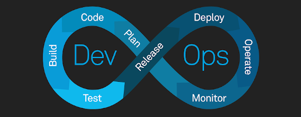
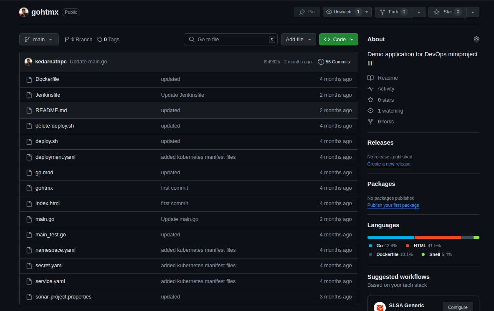
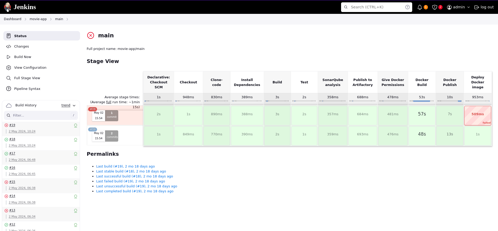
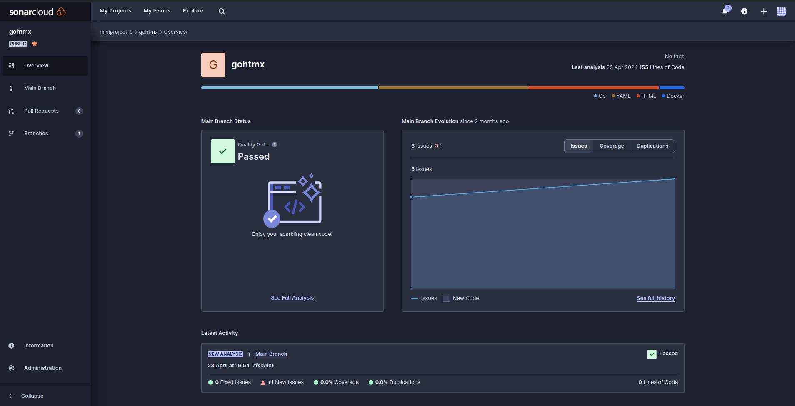

# Understanding DevOps CI/CD Pipeline



## Streamlining Software Delivery

This project is guided by Mr. M. G. Rathi and focuses on implementing a DevOps CI/CD pipeline to streamline the software delivery process.

## What is DevOps?

DevOps is a methodology that combines software development and IT operations to streamline the software delivery process. It offers several benefits:

- **Speed**: Faster development cycles and quicker releases
- **Reliability**: Enhanced software stability and reduced downtime
- **Scalability**: Efficient management of resources for growth
- **Efficiency**: Reduced manual tasks and human errors through automation
- **Quality**: Higher software quality and fewer defects
- **Collaboration**: Improved teamwork and faster issue resolution

## What is CI/CD?

- **Continuous Integration (CI)**: The practice of frequently integrating code changes into a shared repository. Each integration triggers an automated build and test process to detect errors early.
- **Continuous Delivery (CD)**: Extends CI by automating the deployment process, ensuring that code changes are always in a deployable state after passing tests in the CI pipeline.

## Components of CI/CD Pipeline

1. Source Control Management (SCM)
2. Automated Testing
3. Build Automation
4. Deployment Automation

## Tools Used in Our Pipeline

- Infrastructure setup: Terraform
- Source Control Management: GitHub
- Control node: Jenkins
- Quality testing: SonarQube
- Artifact repository: JFrog Artifactory
- Deployment: Docker & Amazon EKS (Kubernetes service)

## Pipeline Phases

1. Infrastructure setup and code management
2. Quality checks
3. Artifact management
4. Deployment
5. Monitoring
6. Continuous improvement

## Challenges and Solutions

### Challenges

- Cultural Resistance
- Tool Complexity
- Legacy Systems Integration
- Security Concerns

### Solutions

- Education and Training
- Incremental Adoption
- Simplify Tooling
- Modularization and Microservices
- Security Automation

##
# Jenkins Pipeline Workflow

The stages of our Jenkins pipeline as shown in the workflow diagram.

## Pipeline Stages

### 1. Code
- Developers write and commit code to the project repository.
- This is the starting point of our CI/CD pipeline.

## 2. GitHub
- Code is pushed to GitHub for version control and collaboration.
- GitHub serves as the central repository for our codebase.



## 3. Jenkins
Jenkins orchestrates the entire CI/CD process:




## 4. Quality Check (Sonarqube)
- Jenkins triggers a Sonarqube analysis.
- Sonarqube performs static code analysis to identify bugs, vulnerabilities, and code smells.
- Results are sent back to Jenkins for evaluation.



## 5. Build and Artifact Storage (JFrog)
- Jenkins builds the application.
- Built artifacts are pushed to JFrog for secure storage and version management.

## 6. Docker Build
- Jenkins uses a Docker slave node to create containerized builds.
- This ensures consistency across different environments.

```
# Start with the official Golang image
FROM golang:latest

# Set the Current Working Directory inside the container
WORKDIR /go/src/app

# Copy go mod and sum files
COPY go.mod ./

# Download all dependencies
RUN go mod download

# Copy the source code from the current directory to the Working Directory inside the container
COPY . .

# Build the Go app
RUN go build -o main .

# Expose port 8080 to the outside world
EXPOSE 8080

# Set the entry point of the container
ENTRYPOINT ["./main"]
```

## 7. Deployment (Kubernetes)
- Jenkins deploys the application to our Kubernetes cluster.
- This stage handles the orchestration of containers in production.

